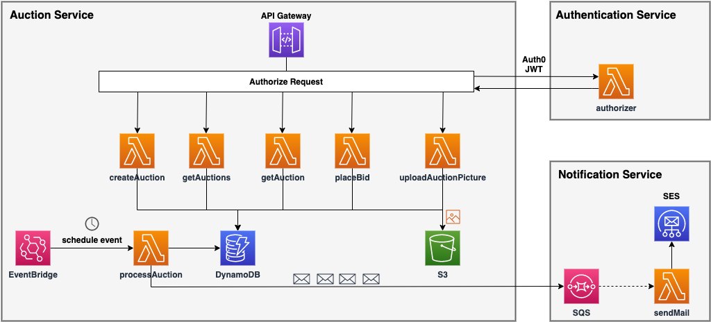

# Serverless Framework BootCamp: Node.js, AWS & Microservices

### § Objectives:

This is a Udemy course taken mainly for me to grasp the concepts of serverless architecture (through AWS in the tutorial) and add new skills to my skill set. It also acts as a reference to our pre-feasibility study of migrating the existing PAACT CRM system to serverless

All the credits go to [Ariel Weinberger](https://github.com/arielweinberger), and the course can be found here : https://www.udemy.com/course/serverless-framework/

### § Technologies:

NoSQL database, Web service authentication (Auth0), REST APIs, MicroServices Architecture, NodeJS

### § AWS Services:

Lambda, Identity and Access Management, Simple Email Service, Simple Queue Service, DynamoDB, CloudFormation, CloudWatch, AWS Budget

